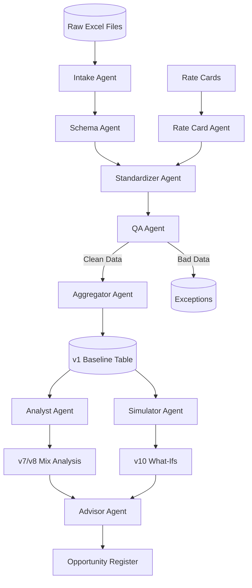

# Multi-Agent Baseline Factory: Implementation Plan

**Objective:** Fully automate the creation of Language Services Baselines (v1-v12) using a system of independent, specialized AI Agents.

## 🟢 Current Status: Phase 1 (Prototyping) - COMPLETE
We have successfully built the "Digital Assembly Line" prototype:
1.  **Intake Agent:** Scans and loads messy Excel files (Healthpoint, Nuvance, Peak Vista).
2.  **Schema Agent:** Automatically maps inconsistent headers (e.g., `Duration` vs `MinuteswithTPD`) to a canonical format.
3.  **Standardizer Agent:** Normalizes data types, dates, and languages.
4.  **Aggregator Agent:** Produces the **v1 Baseline Table** (Spend, Minutes, CPM by Month/Language).

---

## 📅 Roadmap

### Phase 2: Reliability & Financial Integrity (The "Accountant" Phase)
*Focus: Ensuring data accuracy, filling gaps, and reconciling totals.*

*   **1. Missing Cost Imputation (Rate Card Agent)**
    *   **Problem:** Some source files (e.g., AMN/Peak Vista) track minutes but not costs.
    *   **Solution:** Create a `RateCardAgent` that holds contract rates (e.g., "Peak Vista OPI = $0.75/min") and looks up missing costs during standardization.
*   **2. Data QA & Anomaly Detection (QA Agent)**
    *   **Problem:** Garbage data (e.g., 1-second calls, $100/min rates).
    *   **Solution:** Implement `QAgent` to scan `CanonicalRecords` before aggregation. Flags outliers (Z-score) and quarantine suspicious records. (Delivers **v4 QA**).
*   **3. Invoice Reconciliation**
    *   **Goal:** Verify that `Sum(Line Items) ~= Invoice Total`.
    *   **Action:** Enable Intake Agent to read summary tabs ("Invoice" sheets) and compare against calculated totals. (Delivers **v3 Invoices**).

### Phase 3: Analytical Depth (The "Analyst" Phase)
*Focus: Explaining the "Why" behind the numbers.*

*   **1. Rate Efficiency & Mix Analysis (Analyst Agent)**
    *   **Goal:** Calculate Effective CPM and Mix Impact. (Delivers **v7/v8**).
    *   **Action:** Build logic to quantify: "Did spend go up because rates increased, or because volume shifted to expensive languages (e.g., Mayan/Burmese)?"
*   **2. Modality Refinement**
    *   **Goal:** Perfect OPI vs. VRI vs. On-Site classification. (Delivers **v2 Modality**).
    *   **Action:** Enhance Standardizer regex to catch subtle cues (e.g., "Device Name: iPad" implies VRI).

### Phase 4: Strategic Intelligence (The "Consultant" Phase)
*Focus: Predictive modeling and actionable recommendations.*

*   **1. Benchmarking (Benchmark Agent)**
    *   **Goal:** Compare effective rates against market standards. (Delivers **v9**).
    *   **Action:** Ingest external benchmark data and flag vendors/languages paying above market.
*   **2. Scenario Simulation (Simulator Agent)**
    *   **Goal:** "What-If" Analysis. (Delivers **v10**).
    *   **Action:** "If we move 20% of Spanish VRI to OPI, how much do we save?"
*   **3. Recommendations Engine (Advisor Agent)**
    *   **Goal:** Final Opportunity Register. (Delivers **v12**).
    *   **Action:** Automatically generate a ranked list of savings opportunities based on the outputs of previous agents.

---

## 🏗 Architecture Overview

