# 🗺️ Multi-Agent System Architecture Map
**Status:** AI-Powered Hybrid System (Optimized)
**Date:** 2026-02-09
**Version:** v3.0

This document maps the current operational logic of the "Baseline Factory," highlighting the interaction between Deterministic Speed and AI Intelligence.

---

## 🧠 Core Intelligence: `AIClient`
*Located in: `src/core/ai_client.py`*
The central "Brain" of the system.
*   **Role:** Wraps OpenAI API interactions.
*   **Resilience:** Automatically falls back to Heuristic Mode if API Key is missing.
*   **Modes:** `ENABLED` (Smart) / `DISABLED` (Fast/Free).

---

## 🔄 The Pipeline Flow & Logic Strategy

### 1. Ingestion Layer
| Agent | Type | Logic Description |
| :--- | :--- | :--- |
| **Intake Agent** | ⚙️ *Deterministic* | Scans folders. Uses keyword scoring to verify if a file is an Invoice or Usage report. |

### 2. Standardization Layer (The "Messy Middle")
This is where raw vendor data is normalized. We use a **Hybrid Approach** here.

| Agent | Type | Logic Description |
| :--- | :--- | :--- |
| **Schema Agent** | 🧠 **AI-First** | 1. **Check Cache:** Has this file signature been mapped before?   2. **AI Reasoning:** Send column headers to LLM to infer meaning.   3. **Heuristic Fallback:** Keyword matching. |
| **Standardizer** | ⚡ **Vectorized** | **High-Performance Python.** Uses pandas vectorization to clean 50k+ rows in seconds. Handles date parsing, currency conversion, and data typing. |
| **Rate Card** | ⚙️ *Deterministic* | Lookups against a contract database. Imputes missing costs based on "Vendor + Modality". |
| **Modality Agent** | 🧠 **AI-Hybrid** | 1. **Fast Regex:** Catches 95% of terms.   2. **AI Classification:** If "Unknown", asks AI to classify the string.   3. **Caching:** Remembers AI decisions. |

### 3. Quality Assurance Layer
| Agent | Type | Logic Description |
| :--- | :--- | :--- |
| **QA Agent** | ⚙️ *Deterministic* | Uses Z-Score statistics to find rate outliers. Flags duplicates and quarantines critical errors. |
| **Reconciliator** | ⚙️ *Deterministic* | "Bottom-Up" vs "Top-Down" math. Compares line-item sums to invoice grand totals. |

### 4. Strategic Layer (The "Insight")
| Agent | Type | Logic Description |
| :--- | :--- | :--- |
| **Aggregator** | ⚙️ *Deterministic* | Compiles the "Baseline v1" dataset. |
| **Analyst Agent** | 🧠 **AI-Enhanced** | 1. **Math:** Calculates Price-Volume-Mix variance.   2. **Narrative:** Sends data to AI for Executive Summaries. |
| **Simulator** | ⚙️ *Deterministic* | Runs "What-If" logic (e.g., "Shift 20% VRI to OPI") to calculate savings. |

---

## � Logic Decision Tree

```mermaid
graph TD
    Start[New File] --> Intake(Intake Scan)
    Intake --> Schema{Schema Knowledge?}
    
    Schema -- Known Signature --> Cache[Load Cached Map]
    Schema -- New File --> AI_Schema[🧠 Ask AI: Map Columns]
    AI_Schema -- Success --> Standardize
    AI_Schema -- Fail/NoKey --> Heuristic[Keyword Match]
    
    Standardize --> Modality{Service Type Known?}
    Modality -- Regex Match --> ValidT[Type: OPI/VRI]
    Modality -- Unknown --> AI_Mod[🧠 Ask AI: Classify String]
    AI_Mod --> ValidT
    
    ValidT --> QA[QA Checks]
    QA --> Reconcile[Reconciliation]
    Reconcile --> Analyst{Analyze Variance}
    
    Analyst --> Math[Calculate PVM]
    Math --> AI_Narrative[🧠 Ask AI: Explain Why?]
    AI_Narrative --> Report[Final Insight]
```

## ✅ System Health
*   **Robustness:** High. The system handles empty files, PDFs, and API failures gracefully.
*   **Efficiency:** Optimized for large datasets (40MB+) via vectorization.
*   **Testing:** Full regression and integration suite (`tests/`) ensures stability.
