1# 🗺️ Multi-Agent System Architecture Map
**Status:** AI-Powered Hybrid System
**Date:** 2026-02-04
**Version:** v2.2

This document maps the current operational logic of the "Baseline Factory," highlighting where AI Intelligence is applied versus where Deterministic Logic is used for speed/cost efficiency.

---

## 🧠 Core Intelligence: `AIClient`
*Located in: `src/core/ai_client.py`*
The central "Brain" of the system.
*   **Role:** Wraps OpenAI API interactions.
*   **Resilience:** Automatically detects if an API Key is missing. If missing, it disables itself, forcing all agents to use their "Heuristic Fallback" logic seamlessly.
*   **Modes:** `ENABLED` (Smart) / `DISABLED` (Fast/Free).

---

## 🔄 The Pipeline Flow & Logic Strategy

### 1. Ingestion Layer
| Agent | Type | Logic Description |
| :--- | :--- | :--- |
| **Intake Agent** | ⚙️ *Deterministic* | Scans folders. Uses keyword scoring to verify if a file is an Invoice or Usage report. |

### 2. Standardization Layer (The "Messy Middle")
This is where raw vendor data is normalized. We use a **Hybrid Approach** here.

| Agent | Type | Logic Description |
| :--- | :--- | :--- |
| **Schema Agent** | 🧠 **AI-First** | 1. **Check Cache:** Has this file signature been mapped before?   2. **AI Reasoning:** Send column headers to LLM to infer meaning (e.g., "Qty" = "Minutes").   3. **Heuristic Fallback:** Keyword matching if AI fails or is disabled. |
| **Standardizer** | ⚙️ *Deterministic* | robust Python Regex for date parsing and string cleaning. **Why?** Processing 100k+ rows via LLM is too slow/expensive. |
| **Rate Card** | ⚙️ *Deterministic* | Lookups against a contract database. Imputes missing costs based on "Vendor + Modality". |
| **Modality Agent** | 🧠 **AI-Hybrid** | 1. **Fast Regex:** Catches 95% of terms (e.g. "OPI", "Video").   2. **AI Classification:** If "Unknown", asks AI to classify the string (e.g., "Remote Visual Svcs" -> "VRI").   3. **Caching:** Remembers AI decisions for the session. |

### 3. Quality Assurance Layer
| Agent | Type | Logic Description |
| :--- | :--- | :--- |
| **QA Agent** | ⚙️ *Deterministic* | Uses Z-Score statistics to find rate outliers (e.g., paying $4.00/min for OPI). Identifies duplicates. |
| **Reconciliator** | ⚙️ *Deterministic* | "Bottom-Up" vs "Top-Down" math. Sums line items and compares to invoice grand totals found via OCR-lite text search. |

### 4. Strategic Layer (The "Insight")
| Agent | Type | Logic Description |
| :--- | :--- | :--- |
| **Aggregator** | ⚙️ *Deterministic* | Compiles the "Baseline v1" dataset. |
| **Analyst Agent** | 🧠 **AI-Enhanced** | 1. **Math:** Calculates Price-Volume-Mix variance.   2. **Narrative:** Sends the financial blocks to AI to write an *Executive Summary* explaining the root cause of spend changes. |
| **Simulator** | ⚙️ *Deterministic* | Runs "What-If" logic (e.g., "Shift 20% VRI to OPI") to calculate potential savings. |

---

## 📊 Logic Decision Tree

```mermaid
graph TD
    Start[New File] --> Intake(Intake Scan)
    Intake --> Schema{Schema Knowledge?}
    
    Schema -- Known Signature --> Cache[Load Cached Map]
    Schema -- New File --> AI_Schema[🧠 Ask AI: Map Columns]
    AI_Schema -- Success --> Standardize
    AI_Schema -- Fail/NoKey --> Heuristic[Keyword Match]
    
    Standardize --> Modality{Service Type Known?}
    Modality -- Regex Match --> ValidT[Type: OPI/VRI]
    Modality -- Unknown --> AI_Mod[🧠 Ask AI: Classify String]
    AI_Mod --> ValidT
    
    ValidT --> QA[QA Checks]
    QA --> Reconcile[Reconciliation]
    Reconcile --> Analyst{Analyze Variance}
    
    Analyst --> Math[Calculate PVM]
    Math --> AI_Narrative[🧠 Ask AI: Explain Why?]
    AI_Narrative --> Report[Final Insight]
```

## ✅ System Health
*   **Robustness:** High. The system does not crash if the Internet acts up or API keys expire; it just gets slightly "dumber" (less semantic understanding) but keeps working.
*   **Efficiency:** AI is applied *surgically* (Schema mapping: 1 call/file; Modality: 1 call/unique term; Analysis: 1 call/month) rather than *brute force* (1 call/row). This keeps costs negligible (<$0.10/run).
